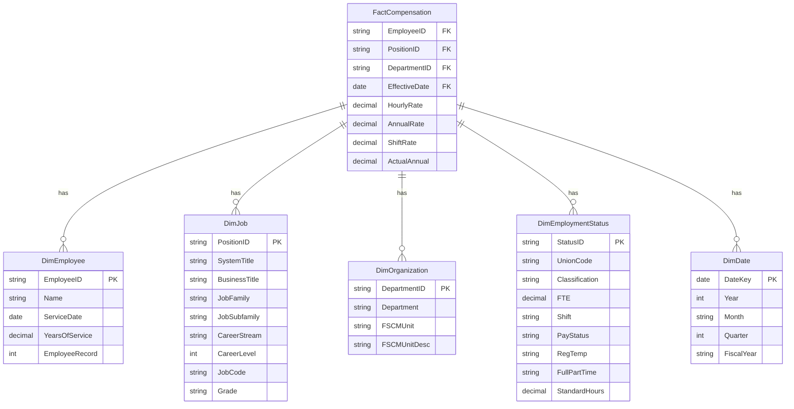

```mermaid
erDiagram FactCompensation ||--o{ DimEmployee : has FactCompensation ||--o{ DimJob : has FactCompensation ||--o{ DimOrganization : has FactCompensation ||--o{ DimEmploymentStatus : has FactCompensation ||--o{ DimDate : has DimEmployee { string EmployeeID PK string Name date ServiceDate decimal YearsOfService int EmployeeRecord } FactCompensation { string EmployeeID FK string PositionID FK string DepartmentID FK date EffectiveDate FK decimal HourlyRate decimal AnnualRate decimal ShiftRate decimal ActualAnnual } DimJob { string PositionID PK string SystemTitle string BusinessTitle string JobFamily string JobSubfamily string CareerStream int CareerLevel string JobCode string Grade } DimOrganization { string DepartmentID PK string Department string FSCMUnit string FSCMUnitDesc } DimEmploymentStatus { string StatusID PK string UnionCode string Classification decimal FTE string Shift string PayStatus string RegTemp string FullPartTime decimal StandardHours } DimDate { date DateKey PK int Year string Month int Quarter string FiscalYear }
```
