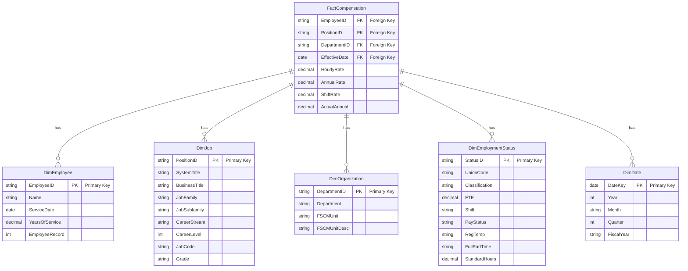

```mermaid
erDiagram
    FactCompensation ||--o{ DimEmployee : has
    FactCompensation ||--o{ DimJob : has
    FactCompensation ||--o{ DimOrganization : has
    FactCompensation ||--o{ DimEmploymentStatus : has
    FactCompensation ||--o{ DimDate : has

    DimEmployee {
        string EmployeeID PK "Primary Key"
        string Name
        date ServiceDate
        decimal YearsOfService
        int EmployeeRecord
    }

    FactCompensation {
        string EmployeeID FK "Foreign Key"
        string PositionID FK "Foreign Key"
        string DepartmentID FK "Foreign Key"
        date EffectiveDate FK "Foreign Key"
        decimal HourlyRate
        decimal AnnualRate
        decimal ShiftRate
        decimal ActualAnnual
    }

    DimJob {
        string PositionID PK "Primary Key"
        string SystemTitle
        string BusinessTitle
        string JobFamily
        string JobSubfamily
        string CareerStream
        int CareerLevel
        string JobCode
        string Grade
    }

    DimOrganization {
        string DepartmentID PK "Primary Key"
        string Department
        string FSCMUnit
        string FSCMUnitDesc
    }

    DimEmploymentStatus {
        string StatusID PK "Primary Key"
        string UnionCode
        string Classification
        decimal FTE
        string Shift
        string PayStatus
        string RegTemp
        string FullPartTime
        decimal StandardHours
    }

    DimDate {
        date DateKey PK "Primary Key"
        int Year
        string Month
        int Quarter
        string FiscalYear
    }
```

[[DimDate]]
